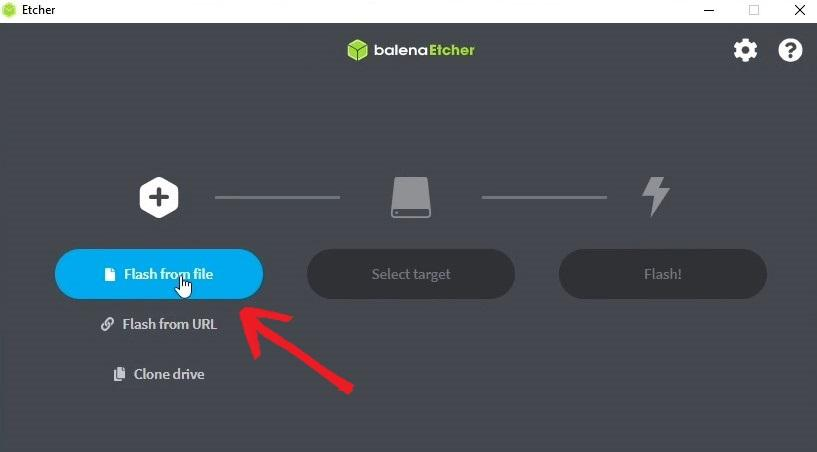
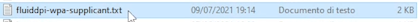

---
hide:

- footer
---

## **What you need!?**

1. Know how to install programs on a Computer
2. Know how to copy and paste
3. 3D Printer
4. Raspberry Pi or alternative SBCs:

=== "Raspberry Pi 3"
    * [Raspberry Pi 3 :material-cursor-default-click-outline:](https://amzn.to/3VLRozg)

=== "Raspberry Pi 4"
    * [Raspberry Pi 4 1Gb :material-cursor-default-click-outline:](https://amzn.to/4mno3X2)

    * [Raspberry Pi 4 2Gb :material-cursor-default-click-outline:](https://amzn.to/4mh3Yl4)

=== "Raspberry Pi 5"
    * [Raspberry Pi 5 4Gb :material-cursor-default-click-outline:](https://amzn.to/41NeHfD)

=== "BTT Pi V1.2"
    * [BTT Pi V1.2 :material-cursor-default-click-outline:](https://amzn.to/46yRkZR)

5. micro SD card (at least 8 GB)
6. Power supply of AT LEAST 2.5A (critical)
7. A good quality USB cable (to connect the Raspberry and the printer’s board)

* [Recommended touch display :material-cursor-default-click-outline:](https://amzn.to/3VJiAyz)

### SOFTWARE

1. [Balena Etcher](https://www.balena.io/etcher/) (to write the OS image to the SD card)
2. [PuTTY](https://www.chiark.greenend.org.uk/~sgtatham/putty/latest.html) (program to send commands to the Raspberry remotely)

### Premise

There are many different ways to install Klipper.

**This guide was created to make the installation as simple as possible without skipping anything, so it may be repetitive at times.**

### In general, the process is:

1. Install an Operating System (OS) on the Raspberry Pi. (In this guide, the Fluidd or MainSail bundle will be installed, which already includes the operating system, web interface, Moonraker, and Klipper, all preinstalled. Other guides install the OS first and then Fluidd or Mainsail; the process is equivalent. Since KIAUH will also be installed, switching Fluidd to Mainsail later is trivial.)

2. Enter Wi‑Fi credentials to connect to the wireless network or plug in an Ethernet cable. Once an OS and internet connection are in place, a PC can connect and send commands to the Raspberry via a terminal.

3. Install the necessary packages: Klipper, the web interface, and Moonraker. (KIAUH will be used to automate the commands; following this guide, everything will be installed in one go!)

4. Flash the Klipper firmware onto the printer’s control board. (If the printer model is common, a ready-made configuration with all info will be in printer.cfg; otherwise, the process is explained.)

5. Configure the printer.cfg file so the printer works correctly.

6. Done

!!! 
    When commands must be entered and they are on separate lines, copy and paste them one at a time: paste the first, press ENTER and wait for it to complete, then the next…


## 👇 LET’S START

1. Download FluiddPI / MainSail

Both Fluidd and MainSail provide an installation bundle that already contains everything needed for Klipper.

By installing this image file (.img) the following are installed in one go: Klipper, Moonraker, and Fluidd/MainSail.

Proceed by downloading the .zip of the preferred interface:

- **[MainSail](https://github.com/mainsail-crew/MainsailOS/releases)**

- **[FluiddPI](https://github.com/fluidd-core/FluiddPI/releases)**

From the GitHub page **download the most recent .zip Latest (the top-most one)**


2. Install FluiddPI to the Raspberry’s SD

To install the bundle on the Raspberry, BalenaEtcher must be installed. It prepares the SD card for the Raspberry and writes the bundle.

➡️ Open Balena Etcher


➡️ Click Flash from file



➡️ Select the .zip file downloaded


➡️ Click Select Target

➡️ Select the Raspberry’s SD card, and click Select


➡️ The third button will activate, **click FLASH**!


➡️ Wait for the process to complete (about 10–15 minutes)


👍

➡️ Eject and then reinsert the SD card into the PC

- Once reinserted, the SD will appear with a new name: boot


### 🛜 Configure Wi‑Fi 🛜

### If using a wired Ethernet connection, connect the Raspberry to the router and skip to step (5)

- Open the files on the boot volume
- Look for the file named: wpa-supplicant.txt



- Open it with Notepad (on Mac, pay attention and follow the instructions in the first lines of the file.)

Depending on the security type (password) used by the Wi‑Fi network, uncomment the correct section:

!!! note
    → \#\# WPA/WPA2 → in 99% of cases this is the section if the Wi‑Fi has an alphanumeric password…

    → \#\# Open/unsecured → use this section if the Wi‑Fi has no password…

- Now remove the \# characters, only the single ones, under the section chosen: WPA/WPA2 …
- Delete the highlighted placeholders and replace them with the correct Wi‑Fi name and correct password!
- ssid=”put SSID here” → put the network name here
- psk=”put password here” → put the password here


!!! note
    ATTENTION!! EVERYTHING MUST REMAIN BETWEEN QUOTATION MARKS

The network name is what appears on any device when connecting to that Wi‑Fi.

- 💾  Save the file.

➡️ Insert the SD card into the Raspberry


➡️ Power the Raspberry to boot it

It is important to use a power supply that provides **at least 2.5A**, otherwise issues due to lack of power will occur.

➡️ Wait a few minutes

Wait for the OS installation to finish; wait until the green LED stops flashing frantically.

### 🎉 GREAT! Klipper is installed on the Raspberry!

#### But it’s not over yet 😡

Friendly tip: shut down the Raspberry and power it back on; sometimes after installation it won’t connect until it is rebooted. To be safe, reboot it anyway before proceeding…

### 🔎 Find the Raspberry on the network

Each time the printer is to be controlled, the Raspberry’s IP address must be entered in the browser.

Identifying the IP can be a hassle if this is a first-time Raspberry use.

The issue is that at each Raspberry boot the Wi‑Fi router assigns an IP, and it may change, so it must be identified again (not always).

There are two methods to find the IP:

→ 🟢 The simplest way:

[http://fluiddpi.local/](http://fluiddpi.local/)

!!! note
    With this address the browser identifies the Raspberry automatically… Works only if the device supports Bonjour...

→ 🟠 Manual IP search:

If http://fluiddpi.local/ doesn’t work, manually search for the IP by accessing the Wi‑Fi router.

The router is generally reachable at this address:

👉 [ 192.168.0.1](http://192.168.0.1) 

➡️ Log in to the router

➡️ Look for the section where all connected Wireless devices appear.

One of the IPs shown will be the Raspberry.

Each router has a different interface; if it isn’t clear, search Google for the procedure for the specific router model.

For example, on a D-Link router:

➡️ Router Login → Advanced → Status → Wireless


## 5. INSTALL → KIAUH

Now that the IP address is known, it is possible to access the Raspberry and send commands via PuTTY.

KIAUH will be installed; it will help in the next steps and in the future for making changes or updating Klipper and its components.

1. **Install PuTTY and open it**

👉 [PuTTY](https://www.chiark.greenend.org.uk/~sgtatham/putty/latest.html)(program to send commands to the Raspberry remotely)

### SSH connection

➡️ Open PuTTY

➡️ Enter the IP address found earlier or [ fluiddpi.local](http://fluiddpi.local/)


➡️ Click Open.

➡️ Accept the warning dialog.

- Raspberry login

Now enter the default credentials:

- Username: pi
- Password: raspberry


➡️ Enter: pi

Press Enter.

➡️ Enter the password: raspberry

Press Enter.

!!! warning 
    The password will not be shown while typing; be careful!

➡️ Install GIT (Required to clone files from GitHub)

Paste this command and press ENTER.

``` bash
sudo apt-get install git -y
```

Press ENTER.

Enter the password again if prompted.

→ The installation is complete when the cursor returns to a new blank line, like this…

## ➡️ Install KIAUH from GitHub

Enter the following commands one after the other: enter the first, press ENTER and wait for completion, then the second… and so on…

``` bash
cd ~
git clone https://github.com/th33xitus/kiauh.git
./kiauh/kiauh.sh
```

If after entering the last command the KIAUH interface opened, proceed…

↓↓ This is the command to run in the future to start KIAUH ↓↓
``` bash
./kiauh/kiauh.sh
```

↑↑ Remember/note this command ↑↑

- Is Klipper installed?


If everything went well, KIAUH Main Menu should show installed: 1 next to Klipper.

On the left are the commands available; on the right is the system status.

## Flash Klipper to the printer board with KIAUH

Now Klipper must be installed on the printer’s microcontroller board.

The procedure varies depending on the printer’s control board.

For example, if using an 8‑bit board with ATmega2560, firmware flashing is done via USB, as with Arduino.

On 32‑bit boards like SKR 1.4, the firmware must be copied onto the SD card and will be installed on the printer’s next reboot.

In the configuration examples all instructions are provided. If nothing is said about how to flash the firmware, it is assumed to be via USB; otherwise the procedure is written there.

These files can be found on [ GitHub di Klipper](https://github.com/Klipper3d/klipper/tree/master/config) or from the interface by going to: **Configuration → CONFIG_EXAMPLES**

Find the file for the specific printer or board, open it; the first part is commented and contains all needed information.


For example, this is the Ender 3 V2 printer.cfg; lines 2 and 3 indicate the microcontroller type and serial port, which are needed shortly; lines 12 to 14 indicate how to transfer the firmware to the board—in this case via SD.

**PROCEED:**

- **Access via SSH terminal**

Just like a moment ago, open PuTTY, log in, and launch KIAUH with: 
``` bash
./kiauh/kiauh.sh
```
- **Type 4 and press ENTER to access the ADVANCED menu**

- **Type 6 and press ENTER → Get MCU ID**

This command returns the printer board’s serial address. This verifies the Raspberry sees the board; this address will be needed later, so copy it now. In PuTTY, copy with right-click.

- **Type 5 and press ENTER → [Build + Flash]**

    With this command the Raspberry will compile the firmware and then install it on the board.

After a few seconds the build window opens →

- **Select Micro-controller Architecture**

Press the down arrow and then ENTER; select the microcontroller architecture found in the example configuration file. Then ENTER.

- **Select Processor model**

Again select the model indicated in the configuration file.

!!! Warning
    Depending on the board for which Klipper is being compiled, other options might be required, such as the serial port… Carefully enter everything requested in the configuration file header! Then proceed.

- **Press Q to save and exit**
- **Select the Flash method**

**1** if via USB – **2** if via SD card

1. **Select the connection type between Raspberry and printer**
2. **Select the printer board address**

If there is only one device, only one will be listed; enter 1 and press ENTER.

1. **Type Y to confirm and wait for the process to complete**
2. **Flashing successful!**

!!! success
    Klipper has been installed correctly!

**End of installation**

!!! Warning
    Flashing via SD directly from KIAUH, on some boards, only works if Klipper is already installed on the printer; some boards require a modified bootloader to perform this operation!
    If an attempt was made to flash the firmware directly from KIAUH to SD and nothing happened, this is the reason.

    * The solution is to retrieve the compiled firmware file, Klipper.bin.
    In this case, in KIAUH’s ADVANCED menu choose BUILD, not BUILD+FLASH, so it compiles the firmware but skips flashing, which will be done manually by moving klipper.bin onto the SD.
    
**To retrieve the firmware:
**
1. Exit KIAUH; press B until returning to the main menu and then Q to exit (see bottom right) — the terminal prompt will be on a new line.

2. Enter this command to move the firmware into the web interface (Mainsail)

``` bash
cp ~/klipper/out/klipper.bin ~/printer_data/config
```

3. Now enter the IP address in the browser to connect to Fluidd/Mainsail
   
4. Go to the section where the config files are; the Klipper.bin file will be there
   
5. Right click -> Download
   
6. Copy Klipper.bin to an SD card and rename it to firmware.bin (some boards require a random name as long as it differs from the one previously used).
   
7.  Power off the printer and insert the SD
   
8.  Power on the printer and wait a few seconds for flashing to complete.

## CONFIGURATION _printer.cfg_

In Klipper, the printer’s configuration is done via the **printer.cfg** file, inside which all printer specifications must be provided; it is critical that it contains everything required. The example files seen earlier are ready-made **printer.cfg **files for that printer model.

These files are created by users and then verified, so they should be correct, but not always.

The correct serial port must always be specified; otherwise the Raspberry will not communicate with the printer.

**- Use KIAUH to find and copy the serial port address**

If it wasn’t copied earlier,

**launch KIAUH → Advanced → [Get MCU ID]**

- copy the entire /dev/serial/by-id/…. string

- Open the web interface (Fluidd, MainSail...)


Go to the configuration section

- **Create or retrieve the printer.cfg for the printer**

Two approaches:

1. Download the configuration file that has been used so far, click + and upload the example file for the printer → rename it as printer.cfg.

2. Click +, create a new file, rename it as printer.cfg, paste the contents of the configuration file.

If the printer is not among the ready-made files, the printer.cfg must be edited manually by entering the required sections found in the [Official Documentation](https://www.klipper3d.org/Config_Reference.html), which is also the reference for any issue. 
!!! warning
    This requires excellent knowledge of the specific printer and Klipper’s functions.

- **Find and enter the [mcu] serial**

Open **printer.cfg ** and find the **[mcu]** section.

Paste the serial address copied from KIAUH after serial:


- **Save and restart**

**Now click SAVE \& RESTART**

AFTER RESTART:

### ERRORS MAY OCCUR


The interface will indicate which errors must be resolved.

This is normal because required sections for Fluidd must be added; if using another interface, they may differ!

These errors are related to the interface being used; Fluidd, in this case, requires these 3 parameters to function correctly.

To resolve, go to the documentation for the interface and look for the Configuration section, where the parameters to be added are listed.

->[ ](https://docs.fluidd.xyz/configuration/initial_setup)[Configuration di Fluidd](https://docs.fluidd.xyz/configuration/initial_setup)

->[ ](https://docs.mainsail.xyz/configuration)[Configuration di Mainsail](https://docs.mainsail.xyz/configuration)


As shown in the documentation, the exact parameters that caused the errors are listed.

Copy and add them one after another into printer.cfg.

Save and do a RESTART (Restart the firmware).

If further issues arise, everything needed to resolve them can be found in the [Official documentation](https://www.klipper3d.org/Config_Reference.html) .

If everything went well, the printer will be connected without issues; it can be controlled and temperatures viewed, etc.


