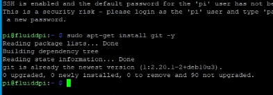

---
hide:
  - footer
---

## **Cosa ti serve !?**

1. **Saper installare programmi sul tuo Computer**

2. **Saper fare copia e incolla**

3. **Stampante 3D**

4. **Raspberry Pi :**

1. Raspberry Pi Zero 2 W

=== "Raspberry Pi 3"
    * [Raspberry Pi 3 :material-cursor-default-click-outline:](https://amzn.to/3VLRozg)

=== "Raspberry Pi 4"
    * [Raspberry Pi 4 1Gb :material-cursor-default-click-outline:](https://amzn.to/4mno3X2)

    * [Raspberry Pi 4 2Gb :material-cursor-default-click-outline:](https://amzn.to/4mh3Yl4)

=== "Raspberry Pi 5"
    * [Raspberry Pi 5 4Gb :material-cursor-default-click-outline:](https://amzn.to/41NeHfD)

=== "BTT Pi V1.2"
    * [BTT Pi V1.2 :material-cursor-default-click-outline:](https://amzn.to/46yRkZR)

5. **Scheda micro SD (almeno 8 Gb)**

6. **Alimentatore da ALMENO 2.5A ***(fondamentale)*

7. **Cavo USB di buona qualità (adatto per collegare raspberry e Scheda stampante)**

* [Schermo touch consigliato :material-cursor-default-click-outline:](https://amzn.to/3VJiAyz)

### **SOFTWARE**

1. **[Balena Etcher](https://www.balena.io/etcher/)** (per scrivere l’immagine del S.O. su scheda SD)

2. **[PuTTY](https://www.chiark.greenend.org.uk/~sgtatham/putty/latest.html)** (Programma per inviare comandi al raspberry da remoto)

### **PREMESSA**

Ci sono tante strade diverse per installare klipper.

**Ho creato questa guida per rendere l’installazione il più semplice possibile senza tralasciare nulla, quindi a volte sarò ripetitivo.**

### **In Generale il Procedimento è questo:**

1. **Installazione di un Sistema Operativo (S.O.) sul raspberryPi. **(*in questa guida installeremo il pacchetto di Fluidd o MainSail che contiene già il sistema operativo, interfaccia grafica, Moonraker e Klipper, tutto preinstallato. Altre guide installano prima il S.O. e poi Fluidd o Mainsail, il procedimento è uguale, dato che installeremo anche KIAUH, sarà poi banale sostituire Fluidd a mainsail)*

2. **Inserire le credenziali WI-Fi per connettersi alla rete wireless o collegare cavo di rete. **Una volta che abbiamo un S.O. ed una connessione internet possiamo collegarci dal PC per inviare dei comandi al raspberry tramite terminale.

3. **Installare i vari pacchetti necessari**: Klipper, interfaccia grafica e moonraker. *(Noi useremo KIAUH che automatizza i comandi da inserire, comunque se seguirete la mia guida troverete tutto installato in un colpo solo!)*

4. **Flash del firmware Klipper, sulla scheda della stampante*** (se avete una stampante diffusa, troverete la configurazione già pronta con tutte le info nel file printer.cfg, altrimenti vedremo come fare).*

5. **Configurare il file *****printer.cfg*** in modo che la stampante funzioni correttamente.

6. FINE

- Quando trovi dei comandi da inserire, se sono posti su righe separate vanno copiati e incollati separatamente, prima uno, premi INVIO e aspetti che venga eseguito e poi l’altro…

## **👇  ****INIZIAM****O**

1. **Scarica FluiddPI / MainSail**

Sia Fluidd che MainSail mettono a disposizione un pacchetto di installazione che contiene già tutto il necessario per klipper.

Installando questo file immagine(.img) troveremo installati : **Klipper**, **Moonraker** e **Fludd/MainSail** in un colpo solo.

Procedi scaricando il file .zip dell’interfaccia che preferisci:

- **[MainSail](https://github.com/mainsail-crew/MainsailOS/releases)**

- **[FluiddPI](https://github.com/fluidd-core/FluiddPI/releases)**

Dalla pagina Github **scarica il file .zip più recente *****Latest*** *(quello più in alto)*


2.** Installa FluiddPI sulla SD del Raspberry**

Per installare il pacchetto sul raspberry devi avere installato BalenaEtcher, programma che prepara la scheda sd per il Raspberry ed installa il pacchetto.

➡️  Apri **Balena Etcher**


➡️  Premi su **Flash from file**


➡️ Seleziona** il file .zip che hai scaricato**


➡️ Clicca su** Select Target**

➡️ seleziona** la scheda SD del Raspberry, **e clicca su** Select**


➡️  Si attiverà il terzo pulsante**,** Clicca su** FLASH!**


➡️** Attendi la fine del processo ***(circa 10/15 minuti)*


*👍*

➡️** Estrai e poi rimetti la scheda SD nel PC **

- *Quando rimetti la sd nel pc avrà un nuovo nome :*** boot**

### 
### **🛜  Configura il Wi-Fi  🛜**

### **Se utilizzi una connessione con cavo di rete, collega il Raspberry al router e salta al punto (5)**

- Accedi ai file della scheda** boot**

- **cerca **il file denominato:** ************-wpa-supplicant.txt***


- **Aprilo con il blocco note ***se usi Mac stai attento e segui le indicazioni poste nelle prime righe del file.*

*In base al tipo di sicurezza*(password)* impostato sulla tua rete Wi-Fi dovrai de commentare la sezione corretta:*

*→ ***## WPA/WPA2** → nel 99% dovrai cercare questa sezione se la tua Wi-Fi ha una password di lettere e numeri…

→ **## Open/unsecured** → Questa sezione se la tua Wi-Fi non ha una password…

- A questo punto cancella i caratteri **# , solo quelli singoli**, posti sotto alla sezione che hai scelto : WPA/WPA2 ….

- Cancella le parti evidenziate e sostituiscile con il nome Corretto della wi-fi e la password Corretta!

- ssid=”put SSID here” ***→ qui nome rete***

- psk=”put password here” ***→ qui password***


**ATTENZIONE!! IL TUTTO DEVE RESTARE TRA LE VIRGOLETTE**

*Il nome della rete è quello che compare su un qualsiasi dispositivo quando ti colleghi a quel wi-fi.*

- 💾 **SALVA **il File.

➡️** Inserisci la scheda SD nel raspberry**


➡️** Alimenta il raspberry per avviarlo**

E’ importante utilizzare un alimentatore che fornisca **almeno 2.5A** altrimenti ti imbatterai in problemi dovuti alla carenza di energia.

➡️** Attendi qualche minuto**

Attendi la fine dell’installazione del sistema operativo, aspetta finché il led verde smette di lampeggiare all’impazzata.

### 🎉** BRAVO! hai installato KLIPPER sul raspberry!**

#### **Ma non è ancora finita 😡**

Consiglio spassionato? Spegni il Raspberry per poi riaccenderlo, non so perché ma a volte dopo l'installazione non riuscirai a connetterti fino a quando non lo riavvii.** Per scrupolo riavvialo comunque prima di procedere…**

### **🔎**** Individua il Raspberry in Rete**

## 
Ogni volta che vorrai comandare la stampante, dovrai inserire l’indirizzo IP del raspberry nel browser.

Identificare l’indirizzo IP può essere una seccatura, se è la prima volta che usi un Raspberry.

Il Problema è che ad ogni accensione del Raspberry il Router Wi-Fi gli assegna un IP, e ogni volta devi individuare l’IP *(non sempre)*.

**Ci sono due metodi per trovare l'IP :**

**🠒 🟢 La strada più semplice:**

[http://fluiddpi.local/](http://fluiddpi.local/)

Con questo indirizzo il vostro browser, individua da solo, il Raspberry…**Funziona solo se il dispositivo supporta****[ Bonjour](https://it.wikipedia.org/wiki/Bonjour)**

**🠒 🟠 Ricerca Manuale IP**:

Se[ http://fluiddpi.local/](http://fluiddpi.local/) non funziona allora **devi cercare manualmente l’IP**, per farlo devi **accedere al tuo Router Wi-Fi**.

Generalmente Raggiungi il Router a questo indirizzo:

👉 [ 192.168.0.1](http://192.168.0.1) 

➡️** ** Effettua il **Login** al Router

➡️** ** Cerca la sezione dove compaiono tutti i ***dispositivi Wireless***** connessi** al Router.

Uno degli IP mostrati sarà quello del Raspberry.

Ogni Router ha interfacce diverse, se non riesci, cerca su Google la procedura per il tuo router.

Ad esempio sul mio router D-link devo fare così:

➡️**  Login** *al Router *→ **Advanced → Status → Wireless**


## 
## **5.INSTALLIAMO → KIAUH**

Ora che conosci l’indirizzo IP, potrai accedere al Raspberry e inviargli dei comandi, tramite PuTTY.

Andremo ad installare KIAUH, un componente che ti aiuterà nei prossimi step e in futuro se vorrai fare delle modifiche o aggiornare klipper e i suoi componenti.

1. **Installa PuTTY e aprilo**

👉  **[PuTTY](https://www.chiark.greenend.org.uk/~sgtatham/putty/latest.html)** (Programma per inviare comandi al Raspberry da remoto)

### **Connessione SSH**

➡️** Apri PuTTY**

➡️** inserisci l’indirizzo IP **trovato prima oppure[ fluiddpi.local](http://fluiddpi.local/)


➡️** **clicca su **Open**.

➡️** **Accetta l’avviso che si apre.

- **Login Raspberry**

A questo punto devi inserire le credenziali che di default sono:

- Username: pi

- password: raspberry


➡️**  **inserisci: pi

.**  **Premi Invio.

➡️**  **Inserisci la password: raspberry

. Premi Invio.

**⚠️ Non verrà mostrata la password mentre la digiti quindi fai attenzione!!**

➡️**  Installa GIT ***(Serve per poter clonare i file da gitHub)*

incolla questo comando e premi INVIO.

``` bash
sudo apt-get install git -y
```

🠒premi INVIO.

**inserisci nuovamente la password se ti viene richiesto.**

**→ L’installazione è completa quando il cursore va a capo su una riga vuota, così…**



## ➡️ **Installa KIAUH da Github**

*inserisci i seguenti comandi uno dopo l'altro, inserisci il primo premi INVIO ed aspetta che venga eseguito, inserisci il secondo….così via…*
``` bash


cd ~

git clone https://github.com/th33xitus/kiauh.git

./kiauh/kiauh.sh
```

Se inserendo l’ultimo comando si è aperta l’interfaccia di KIAUH, procedi…

↓↓ Questo è il comando che dovrai inseririe in futuro per avviare KIAUH ↓↓
./kiauh/kiauh.sh

↑↑ Ricordati/segnati questo comando ↑↑
- **Klipper è installato?**


Se tutto è andato bene dal Main Menu di KIAUH, dovresti vedere installed: 1 in parte a Klipper..

A Sinistra vedi i comandi che puoi utilizzare a Destra vedi lo stato del sistema.

## **Flashare Klipper sulla scheda Stampante con KIAUH**

A questo punto devi installare klipper sulla scheda a microcontrollore della stampante.

Il procedimento varia in base alla scheda che monta la tua stampante.

Per esempio se monti una scheda ad 8-bit con At-mega2560, il flash del firmware avviene tramite USB, come si fa con Arduino.

Mentre su schede a 32-bit come una SKR 1.4 il firmware va copiato sulla scheda SD e verrà installato al riavvio della stampante.

Negli esempi dei file di configurazione troverete tutte le indicazioni, se non viene detto niente su come Flashare il firmware, si da per scontato che vada fatto tramite USB, altrimenti trovi scritta la procedura.

Questi file li trovate sul[ GitHub di Klipper](https://github.com/Klipper3d/klipper/tree/master/config) oppure dalla vostra interfaccia Andando su:** Configurazione** → **CONFIG_EXAMPLES**

Cerca il file con il nome della tua stampante o scheda, aprilo, la prima parte del file è commentata, qui trovi tutte le informazioni che ti servono.


Ad esempio questo è il printer.cfg di una Ender 3 V2, alla riga 2 e 3 ci viene indicato il tipo di microcontrollore e porta seriale, che ci serviranno tra poco, dalla riga 12 alla 14 ci viene indicato come trasferire il firmware sulla scheda, in questo caso tramite SD.

**Attenzione!!**

Dato che useremo KIAUH non c’è bisogno di copiare il file klipper.bin sulla SD faremo tutto in automatico da KIAUH. Idem se il flash avviene via USB.

Devi solo essere certo di quale metodo utilizzare in modo da scegliere il comando corretto su KIAUH.

**PROCEDI:**

- **Accedi tramite terminale SSH**

Proprio come hai fatto poco fa, apri PuTTY fai il login ed avvia KIAUH con questo comando:** ./kiauh/kiauh.sh**

- **Scrivi 4 e premi INVIO per accedere al menu ADVANCED**

- **Scrivi 6 e premi INVIO → Get MCU ID**

Questo comando restituisce l’indirizzo seriale della scheda stampante. In questo modo verifichiamo se il Raspberry individua la scheda, dopo ci servirà questo indirizzo quindi puoi già copiarlo, su PuTTY lo copi, premendo il tasto Dx, .

- **Scrivi 5 e premi INVIO → [Build + Flash]**

Con questo comando il Raspberry compilerà il firmware e poi lo installa sulla scheda.

Dopo pochi secondi si aprirà la finestra di compilazione →

- **Seleziona Micro-controller Architecture**

Premi la **freccia verso il basso** e poi **INVIO**, seleziona l’architettura del microcontrollore, quella che hai trovato indicata nel file esempio di configurazione. Poi **INVIO**

- **Seleziona Processor model**

Anche qui seleziona il modello indicato nel file configurazione.

##### **⚠️**** In base alla scheda per cui stai compilando klipper, potresti dover inserire altre opzioni, come la porta seriale... Abbi la cura di inserire tutto ciò che ti viene indicato nell'intestazione del file di configurazione ! Poi procedi **

- **Premi Q per salvare ed uscire**

- **Seleziona il metodo di Flash**

**1** se via USB *–* **2** se via scheda SD

1. **Seleziona il tipo di collegamento tra Rasp. e stampante**

2. **Seleziona l’indirizzo della scheda stampante**

Se hai un solo dispositivo ne vedrai solo una, inserisci 1 e premi **INVIO.**

1. **Scrivi Y per confermare ***e aspetta la fine del processo*

2. **Flashing successful !**

**Hai installato correttamente Klipper!**

**FINE installazione**

!!! Warning
    Il flash via SD direttamente da KIAUH, su alcune schede, funziona solo se klipper è già installato sulla vostra stampante, questo perchè alcune schede richiedono un bootloader modificato per effettuare questa operazione!
    Se hai provato a flashare il firmware direttamente da KIAUH su SD e non è successo niente questo è il motivo.

    * La soluzione è recuperare il firmware che hai compilato cioè il file Klipper.bin.
    In questo caso nel menu ADVANCED di KIAUH scegli BUILD non BUILD+FLASH così che ti faccia compilare il firmware ma salti la procedura di flash, che farai manulamente spostando klipper.bin sulla SD.

**Per recuperare il firmware:**

1. Esci da kiauh, premi B fino a quando torni nel menu iniziale e poi Q per uscire (guarda in basso a Dx) - ti troverai nel terminale su una nuova linea.

2. **Inserisci questo** comando per spostare il firmware nell'interfaccia web

``` bash
cp ~/klipper/out/klipper.bin ~/printer_data/config
```


3. Ora inserisci l'indirizzo IP nel browser per collegarti a Fluidd/Mainsail

4. Vai nella sezione dove trovi i file di config, qua troverai il file Klipper.bin

5. Tasto Dx - > Scarica

6. Ora copia il file Klipper.bin su una scheda SD e rnominalo in firmware.bin ( alcune schede richiedono un nome casuale purchè sia diverso da quello usato in precednza).

7. Spegni la stampante e inserisci la SD

8. Accendi la stampante e aspetta qualche secondo che avvenga il flash.

## **CONFIGURAZIONE _ printer.cfg _**

Devi sapere che su Klipper la configurazione della stampante avviene tramite il file ***printer.cfg*** , all’interno del quale dovremo indicare tutte le specifiche della stampante, è fondamentale che contenga tutto il necessario. I file di esempio che abbiamo visto prima non sono altro che dei ***printer.cfg*** già pronti per quel modello di stampante.

Questi file vengono creati dagli utenti e poi verificati, quindi dovrebbero essere corretti, ma non è sempre così.

Bisogna sempre andare a specificare la porta seriale corretta, altrimenti il raspberry non riuscirà a comunicare con la stampante.

- **Tramite KIAUH trova e copia l’indirizzo della porta seriale**

Se non lo hai copiato prima,

avvia** KIAUH → Advanced → [Get MCU ID]**

**- **copia tutta la stringa /dev/serial/by-id/….

- **Apri la tua interfaccia grafica ***(Fluidd,MainSail...)*


Vai nella sezione configurazione

- **Crea o recupera il printer.cfg **per la tua stampante

Puoi procedere in due modi:

1. Scarica il file di configurazione che hai usato fino ad ora, clicca su **+** e carica il file di esempio della tua stampante -> **rinominalo** come **printer.cfg**.

2. clicca su **+** , crea nuovo file, **rinominalo** come printer.cfg, incolla il contenuto del file di configurazione .

Se la tua stampante non è tra i file già pronti dovrai modificare manualmente il file printer.cfg inserendo le sezioni richieste che trovi sulla[ documentazione ufficiale](https://www.klipper3d.org/Config_Reference.html), di riferimento anche per qualsiasi problema. *( richiede un'ottima conoscenza della propria stampante e delle funzioni di klipper )*

- **Trova e Inserisci l’indirizzo seriale [mcu]**

Apri *printer.cfg* e trova la sezione** [mcu]**

Incolla l’indirizzo seriale che hai copiato da** KIAUH, dopo **serial:


- **Salva e riavvia**

Ora premi su** SALVA & RIAVVIA **oppure salva il file e poi dal terminale manda il comando** RESTART.**

**DOPO IL RIAVVIO :**

### **POTRESTI RISCONTRARE DEGLI ERRORI**


Ti viene indicato quali sono gli errori da risolvere.

E' normale in quanto devi aggiungere queste sezioni necessarie per far funzionare Fluidd, ma se usi un'altra intefaccia, potrebbero essere diversi !

Questi errori sono legati all'interfaccia che utilizzi, infatti Fluidd, in questo caso, richiede questi 3 parametri per funzionare correttamente.

Per risolvere basta andare nella documentazione della tua interfaccia e cercare la sezione Configuration, dove trovi i parametri che vanno inseriti.

->[ ](https://docs.fluidd.xyz/configuration/initial_setup)[Configuration di Fluidd](https://docs.fluidd.xyz/configuration/initial_setup)

->[ ](https://docs.mainsail.xyz/configuration)[Configuration di Mainsail](https://docs.mainsail.xyz/configuration)


Come vedi nella documentazione trovi esattamente i parametri che ti creavano errore.

Copiali e inseriscili uno dopo l'altro nel printer.cfg .

Salva e fai un RESTART (Riavvia il Firmware) .

Se dovessi avere ulteriori problemi, troverai tutto ciò che ti serve sapere per risolvere nella[ documentazione ufficiale](https://www.klipper3d.org/Config_Reference.html) .

Se tutto è andato bene sarai connesso alla stampante senza problemi, la potrai controllare, visualizzare le temperature ecc..


